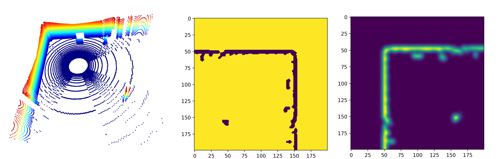
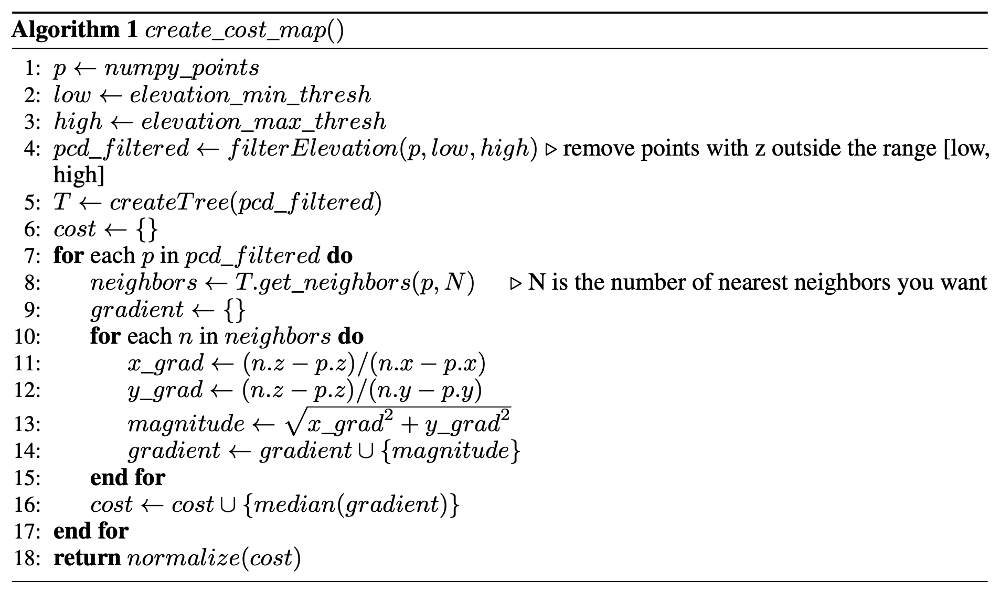

# Robot Perception - Cost Mapping

---

## Introduction

Dive into the fascinating world of robot perception and navigation! This hands-on project explores advanced SLAM-based mapping and cost-map generation, enabling robots to navigate their environment with intelligence and precision. The journey is divided into two exciting parts:

1. **Part 1:** Discover the FAST-LIO2 LiDAR SLAM pipeline to generate a dense point cloud map.
2. **Part 2:** Transform the point cloud into a cost map, paving the way for obstacle avoidance and efficient path planning.

---

## Activity Information

### Objectives

* Master the fundamentals of SLAM and experience setting up and running complex pipelines.
* Create dynamic cost maps and occupancy grids for robotic navigation.
* Experiment with LiDAR datasets to test and visualize the outcomes.

### Resources

* [Quick Introduction to SLAM](https://ouster.com/insights/blog/introduction-to-slam-simultaneous-localization-and-mapping)
* [FAST-LIO2](https://arxiv.org/abs/2107.06829)

### FAST-LIO2

FAST-LIO2 is a powerful LiDAR SLAM system that integrates LiDAR and IMU data for precise pose estimation and mapping. The result is stunning high-resolution point cloud maps, like the one shown below:

*Image: A point cloud map of Davis Hall atrium generated using the Spot robot and an Ouster LiDAR with FAST-LIO2.*

Begin by setting up FAST-LIO2 in your ROS environment. Comprehensive instructions and code are available [here](https://github.com/hku-mars/FAST_LIO).

### The Datasets

Experiment with the provided datasets to create your point clouds using FAST-LIO2! These datasets, stored in `rosbag` format, include topics like `/ouster_points` and `/imu/data`. Due to privacy reasons datasets can't be accessed.

---

## Part 1: Point Cloud Mapping

This segment focuses on generating detailed point cloud maps with FAST-LIO2. The resulting `.pcd` files will provide a complete representation of the environment.

### Steps to Follow

1. Configure FAST-LIO2 to match the topics in the datasets.
2. Run FAST-LIO2 and replay the dataset bags.
3. Visualize the process in `rviz` and observe your point cloud map materialize.
4. Save the completed point cloud as `.pcd` files.
5. Explore your results using tools like [CloudCompare](https://www.danielgm.net/cc/) or PCL tools.

---

## Part 2: Cost Mapping

*The first figure shows the 3D scan from a LiDAR onboard a robot. The second figure depicts a binary cost map where traversable regions have a value of 0 and non-traversable regions have a value of 1. The third figure illustrates a real-valued cost map with each pixel having a value used to compute realistic traversal costs.*

Now, let’s transform your point cloud into a cost map! This representation allows the robot to analyze its surroundings, navigate obstacles, and plan paths effectively.

### What is a Cost Map?

A cost map encodes the environment into traversability information, assigning costs to various regions. This enables robots to make smart navigation decisions.

### Algorithm Overview

Here’s the process for creating a cost map:

1. Load your point cloud data and prepare it for processing.
2. Utilize a KDTree for efficient nearest neighbor calculations.
3. Analyze elevation gradients to determine traversal difficulty.
4. Normalize these values into a 0-1 cost range.
5. Visualize the cost map and appreciate your creation!

### Occupancy Grid

Simplify the cost map by applying a threshold to generate an occupancy grid. In this grid, areas with costs below the threshold are traversable (value 0), while others are non-traversable (value 1). This grid is crucial for navigation algorithms.

### Bringing it All Together

1. Generate a cost map from the point cloud data.
2. Threshold the cost map to create an occupancy grid.
3. Visualize the occupancy grid and imagine your robot seamlessly navigating through it.

---

Enjoy this journey of exploration and innovation as you create intelligent maps for real-world robotic navigation systems!
